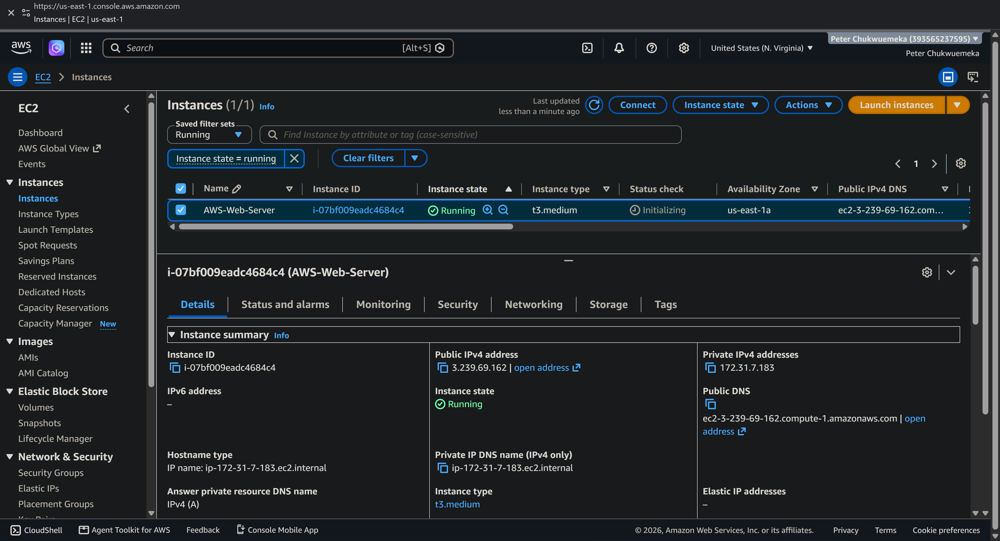
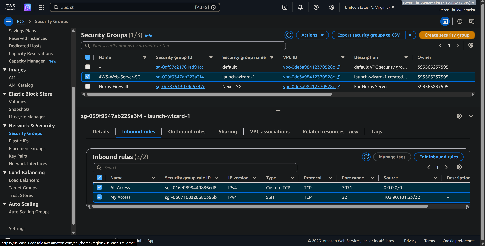
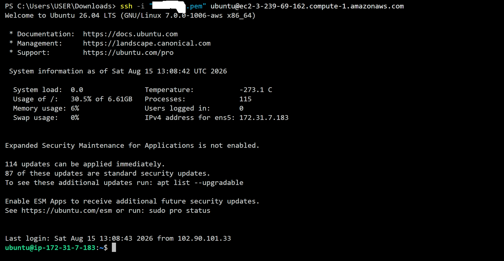
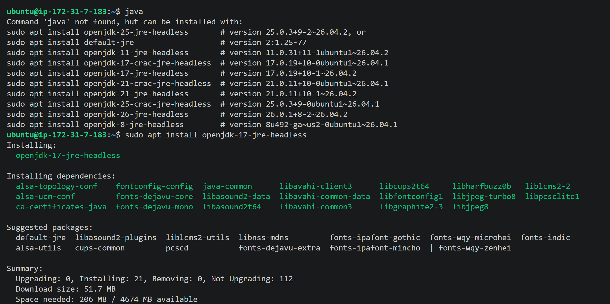
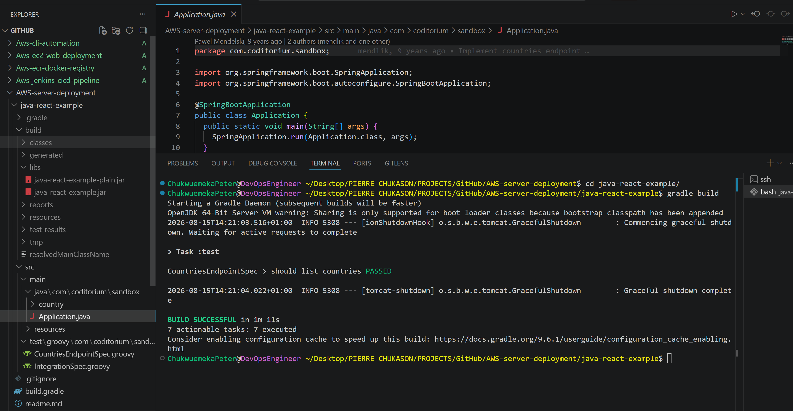
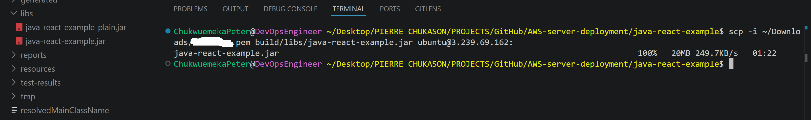
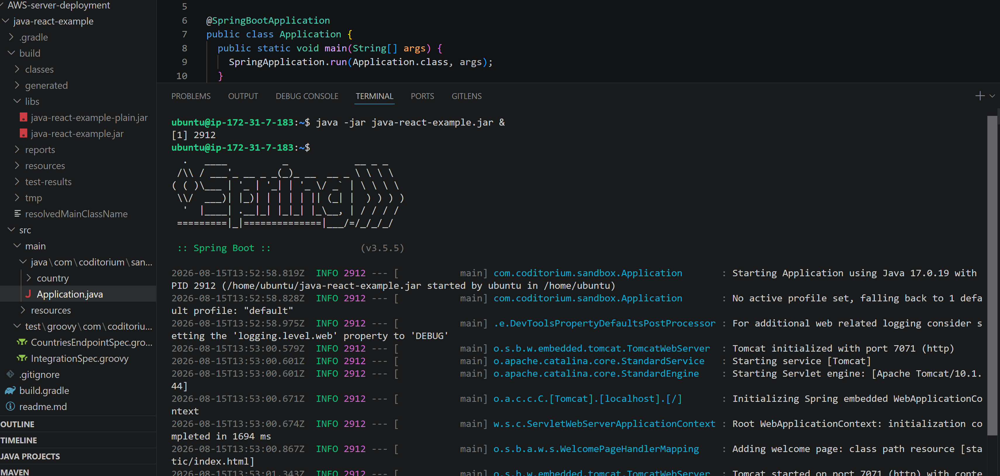
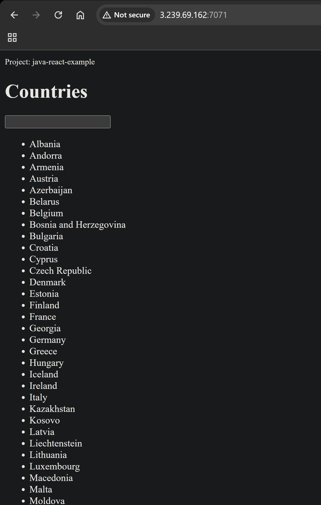
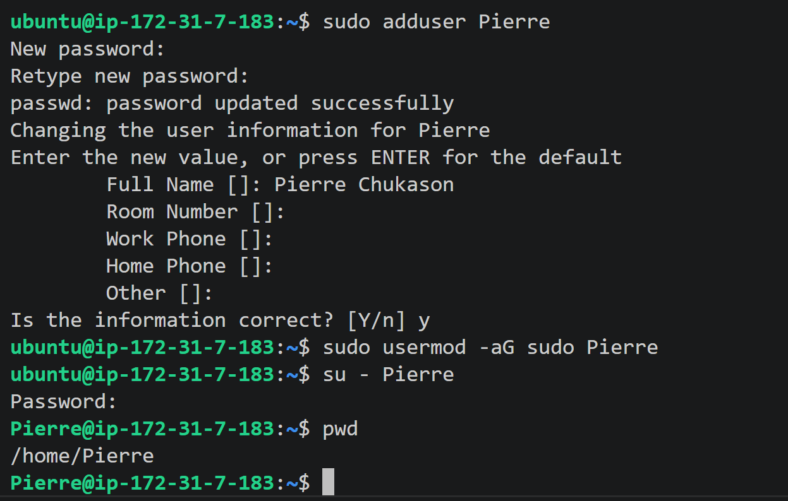

# AWS Server Deployment

> **Provisioning, securing, configuring, and deploying a Java application on AWS EC2**


---

## Table of Contents

* [Project Overview](#project-overview)
* [Objectives](#objectives)
* [Architecture](#architecture)
* [Technology Stack](#technology-stack)
* [AWS Infrastructure](#aws-infrastructure)
* [Network and Security Configuration](#network-and-security-configuration)
* [Server Configuration](#server-configuration)
* [Application Build and Deployment](#application-build-and-deployment)
* [Linux User Management](#linux-user-management)
* [Deployment Workflow](#deployment-workflow)
* [Implementation Evidence](#implementation-evidence)
* [Key Engineering Concepts](#key-engineering-concepts)
* [Engineering Lessons](#engineering-lessons)
* [Project Outcome](#project-outcome)
* [Repository Structure](#repository-structure)
* [Conclusion](#conclusion)

---

## Project Overview

This project demonstrates the deployment of a Java/Spring Boot application onto a remote **AWS EC2 Linux server**.

The implementation covers the complete path from a locally built application artifact to a running application on cloud infrastructure.

The project combines:

* Cloud infrastructure provisioning
* Linux server administration
* SSH-based remote access
* Network security configuration
* Java runtime installation
* Application packaging with Gradle
* Secure artifact transfer
* Remote application execution
* Linux user and privilege management

The objective was not simply to create a virtual machine, but to establish a functioning remote application environment and understand the infrastructure responsibilities involved in operating an application on a cloud server.

---

## Objectives

The project focused on the following engineering objectives:

1. Provision a Linux-based compute instance on AWS.
2. Configure controlled network access to the server.
3. Establish secure remote administration through SSH.
4. Prepare the server with the Java runtime required by the application.
5. Build and package the application locally.
6. Transfer the application artifact to the remote server.
7. Execute the application on the EC2 instance.
8. Expose the application through a controlled network port.
9. Manage Linux users and administrative privileges.
10. Validate the complete deployment from infrastructure to application layer.

---

# Architecture

```text
┌──────────────────────────────┐
│      Local Development       │
│                              │
│  Java / Spring Boot          │
│  Gradle Build                │
│  java-react-example.jar      │
└──────────────┬───────────────┘
               │
               │ SSH / SCP
               ▼
┌──────────────────────────────┐
│          AWS Cloud           │
│                              │
│  ┌────────────────────────┐  │
│  │      EC2 Instance      │  │
│  │                        │  │
│  │ Ubuntu Linux           │  │
│  │ Java 17                │  │
│  │ Spring Boot App        │  │
│  │ Port 7071              │  │
│  └────────────────────────┘  │
│                              │
│      Security Group          │
│      ├── SSH : 22            │
│      └── App : 7071          │
└──────────────┬───────────────┘
               │
               │ HTTP : 7071
               ▼
┌──────────────────────────────┐
│          Web Browser         │
│                              │
│  Application Verification    │
└──────────────────────────────┘
```

### Deployment Model

The deployment follows a simple separation of responsibilities:

**Local environment**

* Application source code
* Gradle build process
* JAR artifact generation

**Cloud environment**

* Compute infrastructure
* Operating system
* Java runtime
* Network security
* Application execution

This separation reflects a fundamental cloud deployment model: the application is developed and packaged locally while the runtime environment is hosted on remote infrastructure.

---

# Technology Stack

| Layer            | Technology               |
| ---------------- | ------------------------ |
| Cloud Provider   | AWS                      |
| Compute          | Amazon EC2               |
| Operating System | Ubuntu 26.04 LTS         |
| Architecture     | `x86_64`                 |
| Instance Type    | `t3.medium`              |
| Region           | `us-east-1`              |
| Storage          | 8 GB                     |
| Runtime          | OpenJDK 17               |
| Application      | Java / Spring Boot       |
| Build Tool       | Gradle                   |
| Artifact         | `java-react-example.jar` |
| Remote Access    | SSH                      |
| File Transfer    | SCP                      |
| Network Security | AWS Security Group       |
| Application Port | `7071`                   |

---

# AWS Infrastructure

## EC2 Configuration

The application was deployed to an AWS EC2 instance configured with:

| Configuration    | Value            |
| ---------------- | ---------------- |
| Instance Type    | `t3.medium`      |
| Operating System | Ubuntu 26.04 LTS |
| Architecture     | `x86_64`         |
| Region           | `us-east-1`      |
| Storage          | 8 GB             |

### EC2 Instance



The EC2 instance provides the compute layer on which the Linux operating system, Java runtime, and application execute.

---

# Network and Security Configuration

Network access was controlled using an AWS Security Group.

### Inbound Rules

| Port   | Protocol | Purpose            | Source        |
| ------ | -------- | ------------------ | ------------- |
| `22`   | TCP      | SSH administration | My IP address |
| `7071` | TCP      | Application access | All sources   |

SSH access was restricted to my IP address rather than exposing the administrative interface broadly.

Port `7071` was exposed for external access to the running application.

Outbound traffic remained under the default AWS configuration.

### Security Group Evidence



The Security Group acts as the network access boundary for the EC2 instance, controlling which traffic can reach services running on the server.

---

# Server Configuration

## Remote SSH Access

The EC2 server was accessed remotely using SSH.

The initial Linux account used for server access was:

```text
ubuntu
```

The connection followed the standard SSH model:

```bash
ssh -i "<private-key>.pem" ubuntu@<ec2-public-dns>
```

Sensitive credentials and private key material are intentionally excluded from the repository.

### SSH Connection Evidence



---

## Java Runtime

The server was configured with **OpenJDK 17**, providing the runtime required by the Spring Boot application.

The environment was updated before Java installation:

```bash
sudo apt update
```

Java was installed with:

```bash
sudo apt install openjdk-17-jdk
```

The runtime was verified with:

```bash
java -version
```

### Java Installation Evidence



---

# Application Build and Deployment

## Application

The deployed application is a Java/Spring Boot application packaged as:

```text
java-react-example.jar
```

The application was built locally using Gradle.

```bash
./gradlew build
```

This generated the deployable JAR artifact used for the remote deployment.

### Build Evidence



---

## Artifact Transfer

The generated JAR file was transferred from the local development environment to the EC2 server using SCP.

```bash
scp -i <private-key>.pem build/libs/java-react-example.jar ubuntu@<ec2-public-ip>:
```

This represents a basic artifact deployment workflow:

```text
Source Code
    ↓
Gradle Build
    ↓
JAR Artifact
    ↓
SCP
    ↓
Remote EC2 Server
```

### Artifact Transfer Evidence



---

## Application Execution

The application was started on the EC2 instance using:

```bash
java -jar java-react-example.jar
```

The application was configured to run on port `7071`.

### Running Application



---

## Application Verification

The running application was verified through a web browser using the EC2 public endpoint:

```text
http://<ec2-public-ip>:7071/
```

Successful browser access confirmed connectivity between the external client and the application running on the EC2 instance.

### Browser Verification



---

# Linux User Management

A separate Linux user was created on the EC2 server as part of server administration and privilege management.

The user was created with:

```bash
sudo adduser pierre
```

The user was also configured with sudo privileges.

```bash
sudo usermod -aG sudo <username>
```

This exercise provided practical experience with Linux identity and privilege management rather than relying solely on the initial administrative account.

### Linux User Evidence



---

# Deployment Workflow

The complete implementation can be represented as:

```text
┌─────────────────────┐
│  Provision EC2      │
└──────────┬──────────┘
           ↓
┌─────────────────────┐
│ Configure Security  │
│ Group               │
└──────────┬──────────┘
           ↓
┌─────────────────────┐
│ Establish SSH       │
│ Access              │
└──────────┬──────────┘
           ↓
┌─────────────────────┐
│ Install Java 17     │
└──────────┬──────────┘
           ↓
┌─────────────────────┐
│ Build Application   │
│ with Gradle         │
└──────────┬──────────┘
           ↓
┌─────────────────────┐
│ Generate JAR        │
│ Artifact            │
└──────────┬──────────┘
           ↓
┌─────────────────────┐
│ Transfer Artifact   │
│ using SCP           │
└──────────┬──────────┘
           ↓
┌─────────────────────┐
│ Execute Application │
│ on EC2              │
└──────────┬──────────┘
           ↓
┌─────────────────────┐
│ Expose Port 7071    │
└──────────┬──────────┘
           ↓
┌─────────────────────┐
│ Browser Validation  │
└──────────┬──────────┘
           ↓
┌─────────────────────┐
│ Linux User          │
│ Management          │
└─────────────────────┘
```

---

# Implementation Evidence

The repository contains visual evidence of the major stages of the implementation.

| Evidence                 | Demonstrates                      |
| ------------------------ | --------------------------------- |
| EC2 instance             | Cloud compute provisioning        |
| Security Group           | Network access control            |
| SSH connection           | Remote server administration      |
| Java installation        | Runtime preparation               |
| Gradle build             | Application packaging             |
| JAR transfer             | Remote artifact deployment        |
| Running application      | Application execution             |
| Browser verification     | End-to-end connectivity           |
| Linux user configuration | Identity and privilege management |

The screenshots complement the technical documentation by providing direct evidence of the implemented environment.

---

# Key Engineering Concepts

## Infrastructure as a Service

The project demonstrates an IaaS model in which compute infrastructure is provisioned remotely and managed as part of the application environment.

Instead of running the application entirely on a local workstation, the application runtime is hosted on cloud infrastructure.

## Remote Server Administration

SSH provides secure command-line access to the EC2 server, allowing the remote Linux environment to be configured and managed from the local development machine.

## Network Boundaries

The AWS Security Group provides a network control layer around the EC2 instance.

The configuration distinguishes between:

* Administrative access through SSH
* Application access through port `7071`

This separation is important because infrastructure management interfaces and application interfaces have different access requirements.

## Artifact-Based Deployment

The application source code is transformed into a deployable JAR artifact through the Gradle build process.

The resulting artifact is then transferred to the target environment and executed there.

```text
Source Code
    ↓
Build
    ↓
Artifact
    ↓
Transfer
    ↓
Runtime
```

This establishes the basic foundation for more advanced CI/CD and automated deployment workflows.

## Linux Privilege Management

Creating a separate Linux user and assigning appropriate administrative privileges provides practical experience with identity and access management at the operating-system level.

---

# Engineering Lessons

### 1. Infrastructure and Application Layers Are Different

A working application requires more than application code.

The deployment also depends on:

* Compute resources
* Operating system
* Runtime dependencies
* Network access
* Security controls
* User privileges

The EC2 instance therefore becomes part of the application's runtime environment rather than simply being a remote machine.

### 2. Network Configuration Is Part of Deployment

An application can be running correctly while remaining inaccessible if the network layer does not permit the required traffic.

The successful deployment therefore required alignment between:

```text
Application
    +
Application Port
    +
EC2 Security Group
    +
Client Connectivity
```

### 3. Deployment Requires an Artifact

The application source code itself was not copied to the server as the deployment unit.

Instead, Gradle produced a JAR artifact that was transferred and executed remotely.

This is an important foundation for understanding artifact repositories and automated deployment pipelines.

### 4. Server Access Requires Deliberate Security Controls

SSH provides administrative access to the infrastructure, making the SSH boundary a security-sensitive component.

Restricting SSH access to a known IP address reduces unnecessary exposure compared with unrestricted SSH access.

---

# Project Outcome

The final environment successfully demonstrated:

* A provisioned AWS EC2 compute environment
* Ubuntu Linux server configuration
* Restricted SSH access
* Java 17 runtime configuration
* Local Gradle application packaging
* JAR artifact transfer to the cloud server
* Remote execution of a Spring Boot application
* Browser-based application verification
* Application network exposure through port `7071`
* Linux user creation
* Sudo privilege configuration

The result is a complete, manually executed cloud deployment workflow from **local application build to remotely accessible application**.

---

# Repository Structure

```text
AWS-Server-Deployment/
│
├── README.md
│
├── java-react-app
│   ├── build.gradle
│   ├── gradle
│   ├── build
├── src/
│   ├── main/
│   └── test/
│
├── screenshots/
│   ├── 01-ec2-instance.png
│   ├── 02-security-group.png
│   ├── 03-ssh-connection.png
│   ├── 04-java-installation.png
│   ├── 05-gradle-build.png
│   ├── 06-jar-transfer.png
│   ├── 07-application-running.png
│   ├── 08-application-browser.png
│   └── 09-linux-user.png
│
├── .gitignore
│
└── ...
```

The repository separates the application source and build configuration from the visual evidence documenting the infrastructure and deployment process.

---

# Conclusion

This project demonstrates the practical operation of a Java application on cloud infrastructure rather than limiting the implementation to local development.

The work spans the infrastructure, operating-system, networking, runtime, application, and access-management layers required to move an application from a developer workstation to a remotely accessible cloud environment.

It establishes a foundation for more advanced engineering practices including automated builds, artifact management, CI/CD, infrastructure as code, service management, observability, and production-oriented cloud operations.

---

## Project Status

**Completed**

* EC2 infrastructure provisioned
* Linux server configured
* SSH access established
* Java 17 installed
* Application packaged with Gradle
* JAR transferred to EC2
* Application deployed and executed
* Port `7071` configured for application access
* Application verified through browser
* Linux user created
* Sudo privileges configured